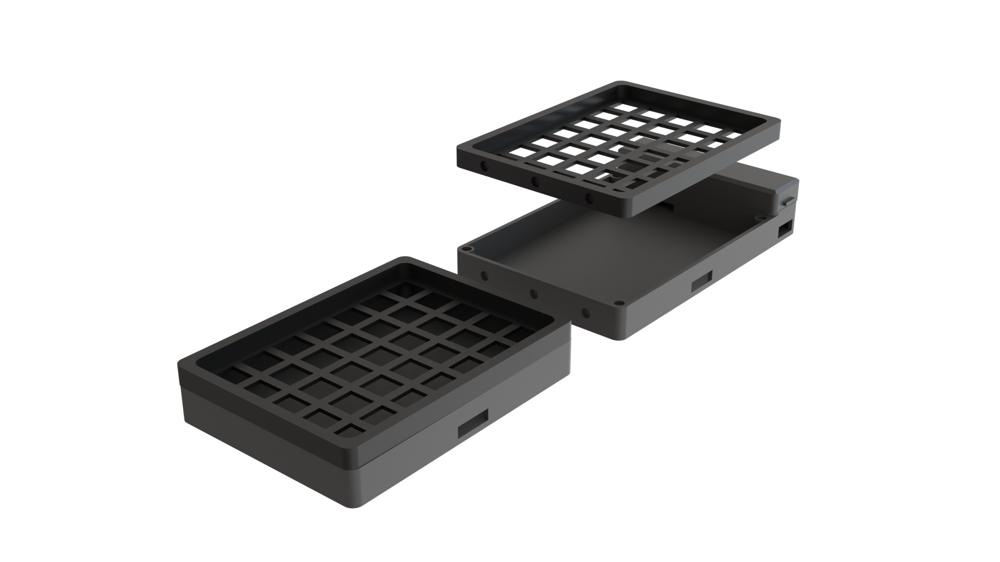

# h70

    

A 3d-printed, RP2040 based 5x14 ortholinear split keyboard. 

* Keyboard Maintainer: [cvhariharan](https://github.com/cvhariharan)

Make example for this keyboard (after setting up your build environment):

    make h70:default

Flashing example for this keyboard:

    make h70:default:flash

See the [build environment setup](https://docs.qmk.fm/#/getting_started_build_tools) and the [make instructions](https://docs.qmk.fm/#/getting_started_make_guide) for more information. Brand new to QMK? Start with our [Complete Newbs Guide](https://docs.qmk.fm/#/newbs).

## Bootloader

Enter the bootloader in 3 ways:

* **Bootmagic reset**: Hold down the key at (0,0) in the matrix (usually the top left key or Escape) and plug in the keyboard
* **Physical reset button**: Briefly press the button on the back of the PCB - some may have pads you must short instead
* **Keycode in layout**: Press the key mapped to `QK_BOOT` if it is available

## Parts
- Waveshare RP2040 Zero
- Gateron Yellow Switches x 70
- 1N4148 Diodes x 70
- Akko Gold and Yellow SAL Profile Keycaps
- 3D printed enclosure
- Wires
## Schematic

    

